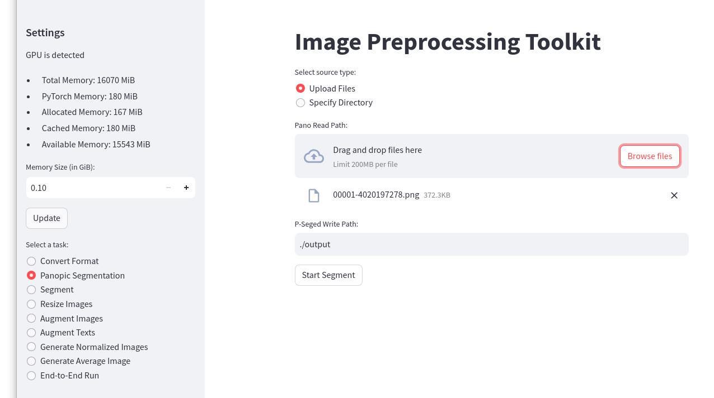
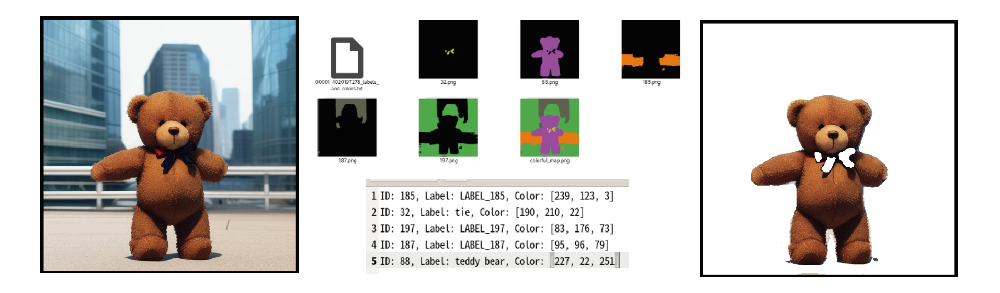
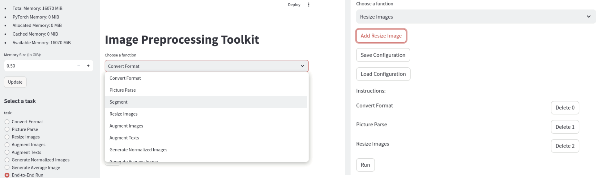

# IP-Toolkit
Image Preprocessing Tool Kit

## Overview

IP-Toolkit focuses on a preprocessing for data-set to train of deep learning (but not limited to use case).
Bellow screen shot shows the GUI. 
Left side shows memory usage status, and you can select one of functions.
The picture shows select of a picture parse.
You can select uploading files or specify directory for input images, and can set output directory.
By clicking Start bottun, it starts panopic segmentation.

The processing is based on a **batch**, you do not need specifying batch size, etc, just the batch processing decides these parameters and run, so you do not meet ouf-of-memory error.

Prepairing data-set is important and very time-consuming process.
This tool supports your training with "batch" processing.
Some time training needs a cropping or a removing particular object(s) in an image, then this tool supports like this;

Below picture shows an end-to-end processing.
This feature can chain every functions in sequential order and can run sequentially.
You can add/remove functions.
The picture shows that execution starts from conversion for image files, second work is picture parse, and last is resize images, these are pipelined.

## Source Code@GitHub
https://github.com/264575/IP-Toolkit

## License
see LICENSE file.

## Features
1. Simple user interface
2. Batch processing for your memory size
3. End-to-End Batch processing
4. Easy to modify/customize for your preferred purpose

### Functions
- Convert Format: Convert to another format.
- Picture Parse: Parse picture to objects.
- Extract Segment: Extract segmentation having particular semantics.
- Remove Segment: Fill a color to the segment(s) having particular semantics.
- Resize: Resize images, this work improves accuracy by fitting images to your training model.
- Augment images: Generate similar images for augmentation.
- Augment texts: Generate similar texts for augmentation.
- Normalize images: Generate pt files
- Average Image

#### Resize
Resizing images supports with/without aspect-ratio.

#### Augment images
Image augmentation supports;
- x-flipping
- y-flipping
- sliding(shifting): slide x, y and or both direction with tic in specified range.
- rotating: rotate with base angle and tic in specified range.

## System Requirement

- Picture parse needs 12GB for DETR model, 16GiB GPU memory is needed at least

## Prerequisite Packages
- streamlit
- json
- time
- os
- io
- typing
- numpy
- PIL
- torch
- transformers

## How to run
- cd to IP-Toolkit directory
- streamlit run iptoolkit.py

### Default setting
Default setting for writing paths is described in config.txt file, so you can modify the setting.

### Typical work flow
1. option: image conversion for picture parsing
2. option: resize converted images for fitting to picture parsing
3. picture parsing for the resized images
4. extract segment for needed semantics, remove segment for unneeded segment(s) (ex. white-fill for background)
8. resize extracted segment images for fitting to your training model
9. augmentation for images and or texts (semantics) for increasing the number of data

## Current Statement

### Functions
All functions are in state of runnable, and supports the batch processing (except for averaging).

## Trained Model used for IP-Toolkit
- DETR model for picture parse
- GPT2 model for text augmentation

This program is generated by ChatGPT 4.0.
